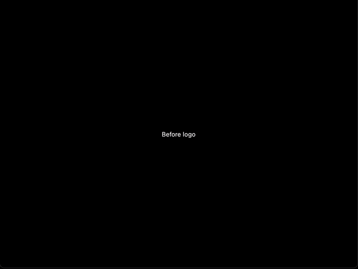

[](https://pub.dartlang.org/packages/flame_splash_screen)
[]


# Flame Splash Screen 




Style your flame game with a beautiful splash screen.

This package includes a `FlameSplashScreen` widget. 

## Install

Add `flame_splash_screen` as a dependency in your pubspec.yaml file ([what?](https://flutter.io/using-packages/)).

Import the widget:
```dart
import 'package:flame_splash_screen/flame_splash_screen.dart';
```

## Usage

The splash screen is a widget that can be used to show the splash screen. 

### Simple usage

There is just two required params:
- `onFinish`, a callback that is executed when all animations from the splash screen is over.
- `theme`, than can be either `FlameSplashTheme.dark` or `FlameSplashTheme.white`.

```dart
FlameSplashScreen(
  theme: FlameSplashTheme.dark,
  onFinish: (BuildContext context) => Navigator.pushNamed(context, '/your-game-initial-screen')
)
```

#### Adding your own content

You can pass your own logo (or/and anything else) to be shown before or after the flame's logo.

```dart
FlameSplashScreen(
  theme: FlameSplashTheme.dark,
  showBefore: (BuildContext context) {
    return Text("To be shown before flame animation");
  },
  onFinish: (BuildContext context) => Navigator.pushNamed(context, '/your-game-initial-screen'),
)
```

```dart
FlameSplashScreen(
  theme: FlameSplashTheme.dark,
  showAfter: (BuildContext context) {
    return Text("To be shown after flame animation");
  },
  onFinish: (BuildContext context) => Navigator.pushNamed(context, '/your-game-initial-screen'),
)
```
 Remember: you can also specify both `showBefore` and `showAfter` at the same time.

#### Changing theme

By default the splash screen has a dark background. You can change it by specifying the `white` theme.

Aside from `FlameSplashTheme.dark`, you can pass `FlameSplashTheme.white` for a white background.

```dart
FlameSplashScreen(
  theme: FlameSplashTheme.white,
  onFinish: (BuildContext context) => Navigator.pushNamed(context, '/your-game-initial-screen'),
)
```

You can create your own theme passing a custom logo builder (changing flames logo for another one) and a background decoration


### Usage with controller

Controller enables `FlameSplashScreen` to be customized regarding animation duration and when it starts.

There is duration params and `autoStart` (which is true by default).

To use it, make the controller lives as much as a widget state:
```dart
class SplashScreenGameState extends State<SplashScreenGame> {
  FlameSplashController controller;
  @override
  void initState() {
      super.initState();
      controller = FlameSplashController(
        fadeInDuration: Duration(seconds: 1),
        fadeOutDuration: Duration(milliseconds: 250),
        waitDuration: Duration(seconds: 2),
        autoStart: false
      );
  }
  
  @override
  void dispose() {
    controller.dispose(); // dispose it when necessary
    super.dispose();
  }
  
  @override
  Widget build(BuildContext context) {
    return Scaffold(
      body: FlameSplashScreen(
        showBefore: (BuildContext context) {
          return Text("Before the logo");
        },
        showAfter: (BuildContext context) {
          return Text("After the logo");
       },
       theme: FlameSplashTheme.white,
       onFinish: (context) => Navigator.pushNamed(context, '/the-game-initial-screen'),
        controller: controller,
      ),
    );
  }
}
```
